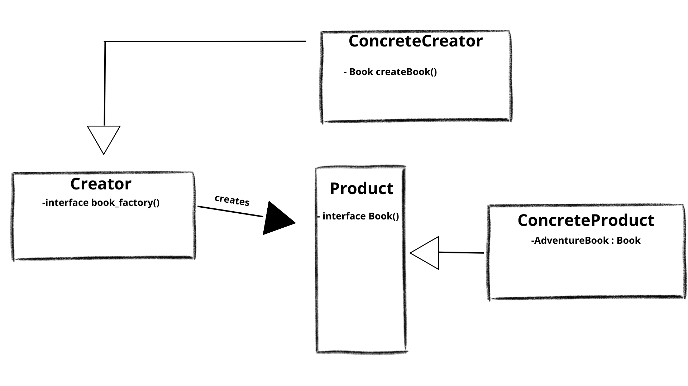
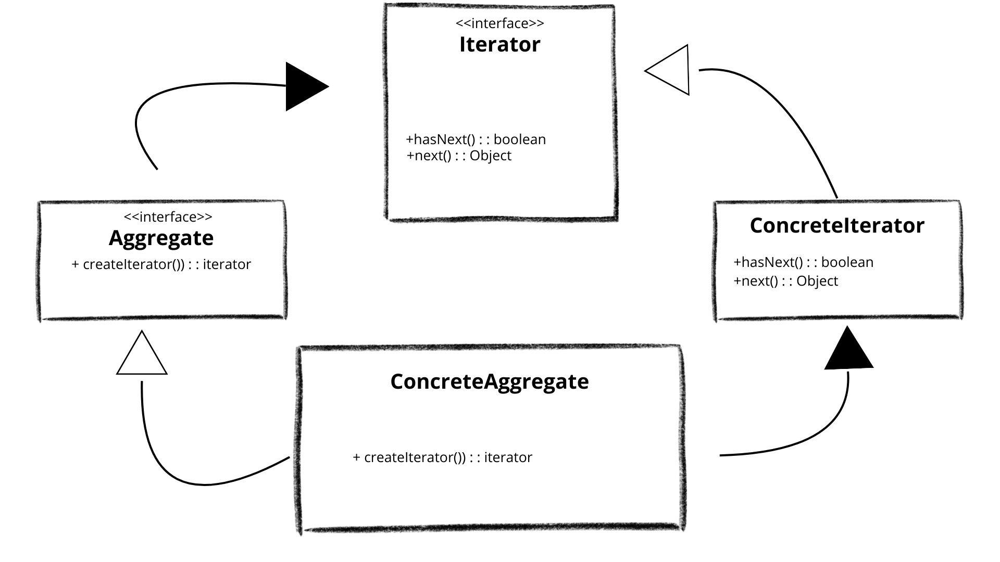
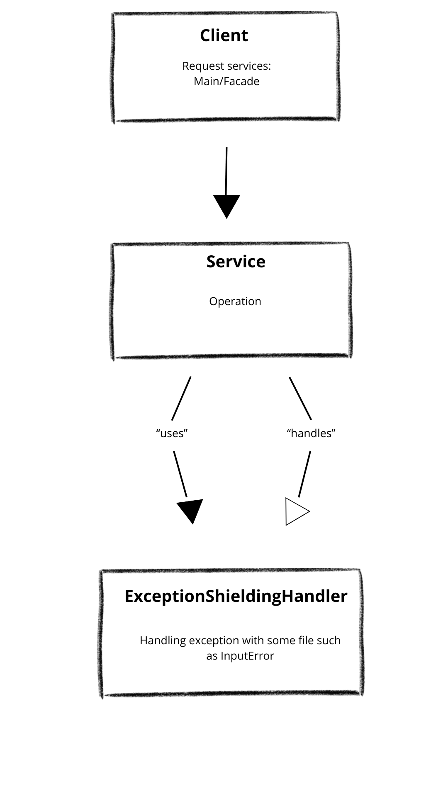
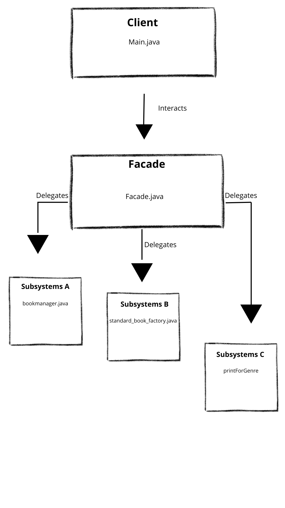
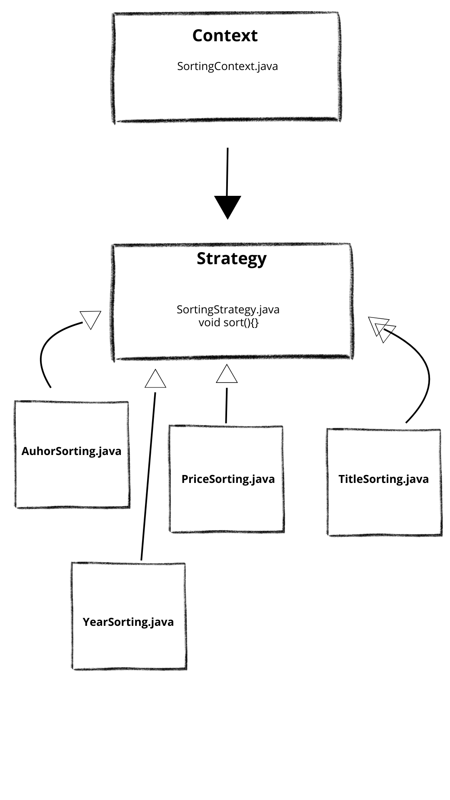
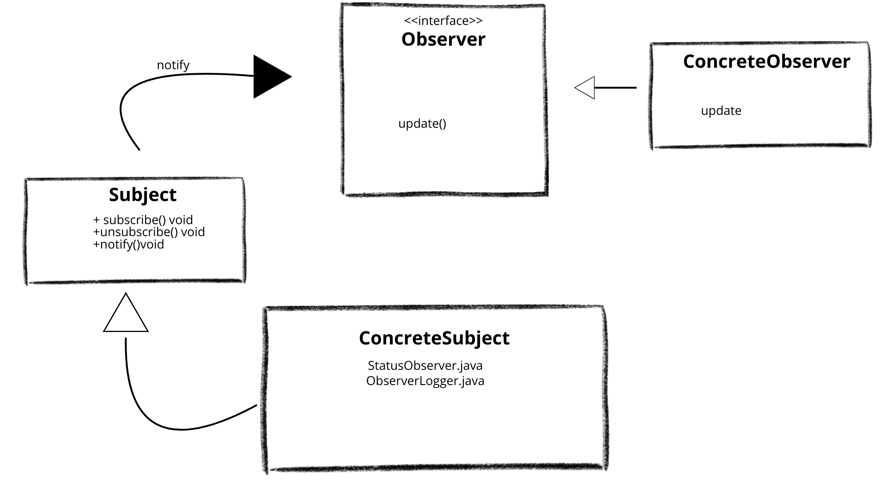

[README.md](https://github.com/user-attachments/files/21982990/README.md)
 # LIBRARY MANAGEMENT APP
 This is a simple library management app built with java.It was built form my Objected Oriented Programming exam, following the examinator's instructions.  
 
 #OVERVIEW
This is simple management system built for library's owner. 
The books are saved in mocked "database". I've used a txt file. 
Through a simple menu, it permit the user to choose the option.  
The project comes from a nightmare of mine: management software. In my work as an IT technician, the biggest problems with backups or changing PCs came precisely from these programs. So I am getting to know my enemy in order to fight it worse. 
The app could be used for other stuff. With minimal change, we can use it for other shop rather than library.

#TECHNOLOGIES AND PATTERN
PATTERN (REQUIRED)    

1)Factory  
2)Composite  
3)Iterator  
4)Exception Shielding  

PATTERN (OPTIONAL)  
1)Facade  
2)Composite  
3)Strategy  
4)Observer  

TECHNOLIGIES(REQUIRED)  

1)Collection Frameworks  
2)Generics  
3)Java I/O  
4)Logging  
5)JUnit Testing (Maven)  

TECHNOLOGIES(OPTIONAL)  
1)STREAM API AND LAMBDAS (PARTIAL, ONLY LAMBDA USE)  
2)CUSTOM ANNOTATIONS  
3)MOCKITO  

#TECHNOLOGIES AND PATTERN: EXPLANATION  
#PATTERN
-FACTORY PATTERN -  
I've used this pattern to abstract the creational process of the book. I've setted up some field, such as title and author and i've used them as a mold to create other books. 

CREATOR (interface): "book_factory.java" exposes "createBook()" method   

PRODUCT(interface): "book.java" rapresents a generic book with all the field. 

CONCRETE PRODUCT: "AdventureBook.java" or other types of book,  rapresents the specific type of the Book.

CONCRETE CREATOR: "standard_book_factory.java" rapresents the real logic to create and validate any concrete product. 

I've enhanced the pattern adding an abstract book class that is extended by sub genre.     

I' ve created an enum genre, in order to have a list of book's genre.  

 

-COMPOSITE PATTERN-  
I've introduced the composite pattern to manage the library in 2 distinct section: rented and not rented.  
In this way user can manage the library and see which book is Rented.

COMPONENT (interface): "rentedLibraryComponent.java" grant common print operation both for book and library.  
  
LEAF :"rentedBook.java" represent single book. Implements COMPONENT to print the detail of the book.

COMPOSITE: "rentedLibrary.java" store a list of COMPONENT. It can add book and print the list.  

  

-ITERATOR PATTERN-  
I've used the iterator pattern to hide the internal status of my app.
The user, through the FACADE does not know the list of the book.  

ITERATOR: "BooksIterator.java". It has two methods that work on the list of the book.

CONCRETE ITERATOR: "LibraryBookIterator.java". Implements ITERATOR and gave an index to the books.

AGGREGATE: "BooksCollection.java". Has a list of the book and apply to it The CONCRETE ITERATOR  

CONCRETE AGGREGATE: "Library.java". Implements AGGREGATE and gave an iterator to the list. 

  
-EXCEPTION SHIELDING-  

With Exception shielding I'm protecting the system/app from leak. I'm protecting internal stake and hiding it to the user and external client.
In this way, I reduce possibly hacker attack. 

CLIENT: "Main.java", "Facade.java" and many other files interact with user.

SERVICE:"standard_book_factory.java", "bookmanager.java" and many other file can generate exception

EXCEPTION SHIELDING HANDLER: "Facade.java" and many other files catch this exception and shows only logger info.  
  

#TECHNOLOGIES  
-COLLECTION FRAMEWORK-   
I used list and array from java collection framework. 
List was used to rapresent the list of book. 
array was used for temporary operation

-GENERICS-  
Generics was used to manage the books collection

-JAVA I/O
Java input/output was used to mock a database in a txt file. 
This permits me to read and write from a file  

-LOGGING-  
Logging was used to take track of internal state or event.
It's used to grant better messages to evenutally new developer (also for me.... I've already forgot what I've writed. Now, only god know my code)

-JUnit Testing-  
JUnit was used to create automatized test. It was used to manage eventually exception  

#OPTIONAL ADVANCED FEATURES  

-PATTERN-  

-FACADE-  
I emplemented FACADE PATTERN because I was going crazy with the functionality of the app. 
With FACADE I create a menu and for every choice there was a subsystem associated (the diagram is not exausistive),
Generally the FACADE  gave a simple interface to the user and do not expose internal functionality

FACADE : "Facade.java" gave to the Main simple method 

SUBSYSTEM: The various subsystem gave function to my app  

  
-STRATEGY-  
I've used strategy pattern to createt a list of sorting algorithm . This algorithm, following the Strategy Patter, could be interchanged runtime  

STRATEGY INTERFACE: "SortingStrategy.Java" : common method for all strategy  

CONCRETE STRATEGIES:"TitleSorting.Java", "AuthorSorting.java","PriceSorting.java","YearSorting.java". Every method sort books in different way.  

CONTEXT CLASS:"SortingContext.java": changing algorithm following user's choice.  

DYNAMIC SWITCHING:Through user choice, the app change the algorithm runtime.  

  

-OBSERVER-  
I've used the observer, in order to notify the user when a book is rented or returned.  
SUBJECT: "LibrarySubject.java" takes the list of observer and sent notification.  

CONCRETE SUBJECT:"LibraryEventHandler.java" take care of the state, mantain the observer and send notify. 

OBSERVER INTERFACE:"LibraryObserver.java" has the update method.  

CONCRETE OBSERVER:"ObserverLogger.java","StatusObserver.java" implements the Observer Interface and update in the log and the user.

  

OPTIONAL TECHNOLOGIES  
CUSTOM ANNOTATIONS   
I've used this optional feature to divide the declarative logic from the procedural logic. 
Using custom annotations is important in order to adding functionality avoiding modifying code    
MOCKITO  
While i was working with junit test, I've introduced Mockito test. 
Mockito permits to isolate soome functionality of the app from third party dependencies and check eventually excepted or unexcepted behaviors

STREAM API AND LAMBDAS    
I have not fully integrated the streamapi, but i've used lambdas.
Lambdas techonologies permits to reduce the verbosity of java, permits to apply filter logic to the apps and simplify the code avoiding anonymous class.

CUSTOM ANNOTATIONS  
In my apps I used custom annotations. Custom annotation permits me to add metadata to method or classes in order to build dinamycally the app.  

MOCKITO  
Alongside Junit I've used Mockito. 
Mockito permits to "mock" "situation"of use of the app. I've used it where possible  

JAVA SWING  
I was thinking to add a gui interface to the app . This permits an easy use of the app. I cannot complete it for lack of time and cause I need to link every "backend " functionality to the gui. There's only an example of the gui

#LIMITATION AND FUTURE WORK  
There are a lot of things I can do on this app. 
First I can integrate a payment system to buy/sell book from/for user.   
I can add a login features with hardcoded credentials. I can create two user: admin and normal user with different operation.  

#SETUP AND EXECUTION INSTRUCTIONS

-Requirements-  

 Java 17 required or newer version.   
 Maven  
 Ide: Visual Studio code  or other

 -Setting up-  

 1)Download repository  
 2)Unzip it  
 3)Verify the structure:  
  pom.xml in libreria folder  
  source code in `src/main/java/giuseppecalvaruso/`  
 4) If you are using IntelliJ verify the project is  
    recognised   as Maven Project

-IDE execution -  
1)Open project with your ide  
2)Go to `Main.java`  
3) Right Click on mouse: run Main  
4) Use app with CLI (Command Line Interface)  

#TEST SUITE  
The project include a folder test with junit and mockito test
The test classes are located in:  
`src/test/java/giuseppecalvaruso/`  
During my test, I thinked about different scenario of use of the app and where possible I have used mockito to mock this scenario. 

- `book_factory_mockito_test.java`  
   Uses Mockito to simulate the creating of a book using book factory and add Book class

- `book_manager_test.java`  
   Verifying the persistence of the mocked database

- `ExceptionShieldMockitoTest.java`  
  Testing Exception_Shielding pattern using mockito

- `ExceptionShieldTest.java`  
   Testing Exception_Shielding with Junit using three different scenario

- `FacadeTest.java`  
  Testing Facade using different input through scanner.  

- `LibraryBookIteratorMockitoTest.java`  
   Testing iterator using a mocked library 

- `LibraryBookIteratorTest.java`  
  Testing iterator using a real library 

- `LibraryTest.java`  
   Verifying the correct creation of the iterator   

- `MainMenuTest.java`  
   Verifying the correctness of the enum 

- `print_for_genre_test.java`  
   Testing printforgenre through different scenario   

- `rentedBooktest.java`  
   Testing the leaf 
- `testing_sort.java`
   Unit test for sorting functionality.
   Verifying sorting functionality

- `rentedLibraryTest.java`  
  Testing the composite of the composite pattern through different scenario 

- `StandardBookFactoryTest.java`  
   Validating the creation of the book 
- `SubBookTest.java`  
   Verifying that the different book with different genre are created succesfully  

#KNOWN LIMITATIONS AND FUTURE WORK  
Known limits of the apps are surely the fact the rented/not rented works on running app. 
Future works include modifying permanently this field in the mocked database.
Future works includes recognizing an external pheripheral such a barcode reader, facilitating reading and writing information about book.
In the future, the app could introduce a customer management (There is already a customer class), where every customer has it's own ID. With the ID, the app prints the info, how many books has rented and how many books could the customer rent.
The books have its own price. 
The app could integrate a sort of payment management, introducing payment via cards, paypal, credit and so on. 
The app was not designed solely for books, but is extendable for any product tha has a barcode. 
For example, if we have to run a grocery shops, we could use the genres of the books as foodstuffs (we have of course to change some names).
Many other improvements are surely adding a gui (I was working on it with Java swings).
I can also use other optional pattern or technologies in order to add more functionality to the app. 
For example, i can add full stream api in order to write less code for complex functionality
I can use multithreading with the gui. While the app read for example the book, I can create a thread for that, so swing do not block.
I've already used custom annotations. I can upgrade it with reflection. With reflection I can reduce the boilerplate code . For example I can avoid writing the switch. With the annotations the code generate the menu automatically.

