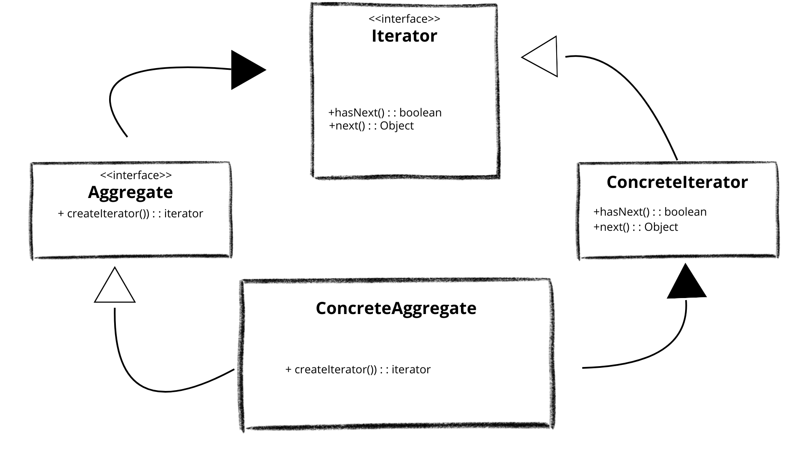

 # LIBRARY MANAGEMENT APP
 This is a simple library management app built with java.It was built form my Objected Oriented Programming exam, following the examinator's instructions.  
 
 #OVERVIEW
This is simple management system built for library's owner. 
The books are saved in mocked "database". I've used a txt file. 
Through a simple menu, it permit the user to choose the option. 

#TECHNOLOGIES AND PATTERN
PATTERN (REQUIRED)    

1)Factory  
2)Composite  
3)Iterator  
4)Exception Shielding  

PATTERN (OPTIONAL)  
1)Facade

TECHNOLIGIES(REQUIRED)  

1)Collection Frameworks  
2)Generics  
3)Java I/O  
4)Logging  
5)JUnit Testing (Maven)

#TECHNOLOGIES AND PATTERN: EXPLANATION  
-FACTORY PATTERN -  
I've used this pattern to abstract the creational process of the book. I've setted up some field, such as title and author and i've used them as a mold to create other books. 

CREATOR (interface): "book_factory.java" exposes "createBook()" method   

PRODUCT(interface): "book.java" rapresents a generic book with all the field. 

CONCRETE PRODUCT: "AdventureBook.java" or other types of book,  rapresents the specific type of the Book.

CONCRETE CREATOR: "standard_book_factory.java" rapresents the real logic to create and validate any concrete product. 

  

-COMPOSITE PATTERN-  
I've introduced the composite pattern to manage the library in 2 distinct section: rented and not rented.  
In this way user can manage the library and see which book is Rented.

COMPONENT (interface): "rentedLibraryComponent.java" grant common print operation both for book and library.  
  
LEAF :"rentedBook.java" represent single book. Implements COMPONENT to print the detail of the book.

COMPOSITE: "rentedLibrary.java" store a list of COMPONENT. It can add book and print the list.  

  

-ITERATOR PATTERN-  
I've used the iterator pattern to hide the internal status of my app.
The user, through the FACADE does not know the list of the book.  

ITERATOR: "BooksIterator.java". It has two methods that work on the list of the book.

CONCRETE ITERATOR: "LibraryBookIterator.java". Implements ITERATOR and gave an index to the books.

AGGREGATE: "BooksCollection.java". Has a list of the book and apply to it The CONCRETE ITERATOR  

CONCRETE AGGREGATE: "Library.java". Implements AGGREGATE and gave an iterator to the list. 

  
-EXCEPTION SHIELDING-

